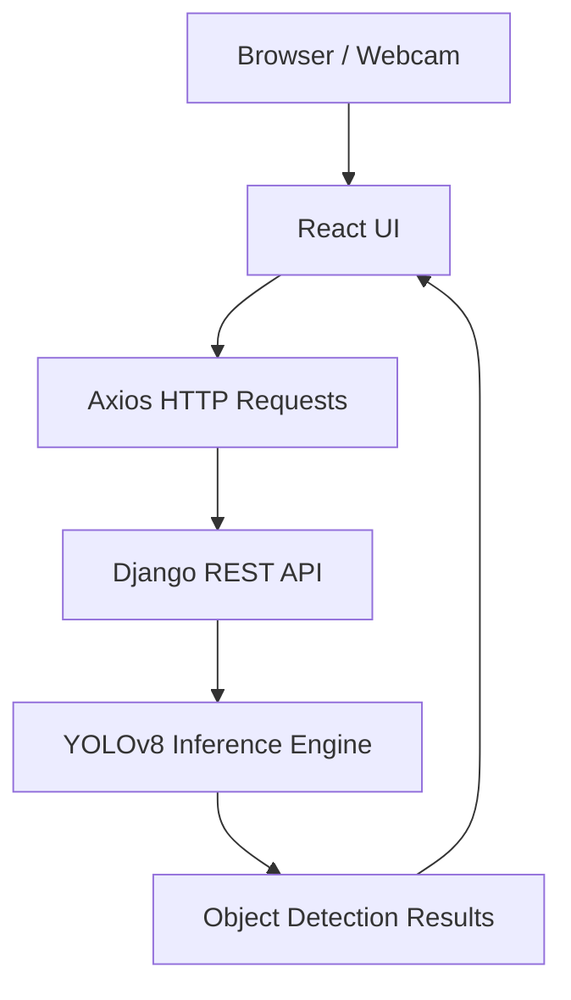

# 🧠 EyeStream - Real-time Object Detection Web App

EyeStream is a full-stack AI-powered application that captures webcam video from the browser, streams it to a Django backend for real-time object detection using **YOLOv8**, and displays the results with bounding boxes and stats.

---

## 🌐 Live Demo

> *(Coming Soon – You can deploy it using Vercel + Render!)*

---

## 🧱 Project Architecture



---

## 🚀 Project Setup Instructions

### 📁 Frontend - React UI

#### 1. Navigate to the UI project folder:

#### 2. Install dependencies:
```bash
npm install axios cors
```

#### 3. Start the React development server:
```bash
npm start
```

> Opens at [http://localhost:3000](http://localhost:3000)

---

### 🖥️ Backend - Django API

#### 1. Navigate to the backend project folder:
```bash
cd backend
```

#### 2. Install dependencies:
```bash
pip install django djangorestframework django-cors-headers pillow ultralytics opencv-python numpy torch
```

#### 3. Start the Django development server:
```bash
python manage.py runserver
```

> API available at [http://127.0.0.1:8000](http://127.0.0.1:8000)

---

## 🧠 YOLO Model Setup

The model will download automatically on first run.  
Or, download manually from:

📥 [YOLOv8n.pt](https://github.com/ultralytics/assets/releases/download/v0.0.0/yolov8n.pt)

Place the file in your Django backend root directory.

---

## ✅ How to Use

1. Start **both** React and Django servers.
2. Open: [http://localhost:3000](http://localhost:3000)
3. Grant webcam access.
4. Click `Start Detection`.
5. See live detection with bounding boxes and labels.

---

## 🐳 Optional: Dockerized Deployment

### 1. Create `Dockerfile` in root (backend + frontend separately or as one full-stack container)

**Sample: backend/Dockerfile**
```dockerfile
FROM python:3.11

WORKDIR /app
COPY . /app

RUN pip install --upgrade pip
RUN pip install -r requirements.txt

CMD ["python", "manage.py", "runserver", "0.0.0.0:8000"]
```

**Sample: frontend/Dockerfile**
```dockerfile
FROM node:18

WORKDIR /app
COPY . /app

RUN npm install
CMD ["npm", "start"]
```

### 2. Add Docker Compose (optional) if you want to manage both in one network.

---

## 🌐 Deployment Tips

- **Frontend**: Host on [Vercel](https://vercel.com/) or [Netlify](https://www.netlify.com/)
- **Backend**: Use [Render](https://render.com/), [Railway](https://railway.app/), or [Azure App Services](https://azure.microsoft.com/)

Make sure to:
- Add CORS rules for your frontend domain in Django
- Use production build: `npm run build` for React

---

## 🛠️ Tech Stack

| Layer     | Technology                     |
|-----------|--------------------------------|
| Frontend  | React + TypeScript             |
| Backend   | Django + DRF                   |
| AI/ML     | YOLOv8, OpenCV, Torch          |
| Utilities | Axios, CORS, Pillow, NumPy     |

---

## 🤝 Contributing

PRs welcome! Please fork and submit a pull request. For major changes, open an issue first.

---

## 📄 License


---
